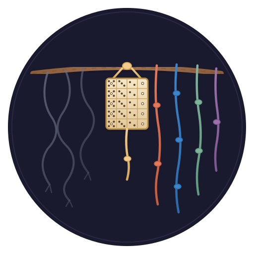

<p align="center">
  
</p>

<h1 align="center">camayoc</h1>

<p align="center">
  <em>🪢 The knot-keeper — bootstrap ontology, knowledge ingress, and knowledge packs for the quipu stack</em>
</p>

<p align="center">
  <a href="LICENSE"></a>
  <a href="https://github.com/scbrown/quipu"></a>
</p>

> *Loose thread goes in. Knotted record comes out. The keeper decides what a knot may claim.*

The *quipucamayoc* (khipukamayuq) was the Quechua-titled official who kept the quipus —
the one who tied knowledge into the knots and certified what was read back out.
That is this repo's job: it owns **what the knots mean** and **how knowledge
earns its way into the graph**, so that the store itself never has to trust an
extractor.

## Role in the stack

```text
shantytown / git / hank / sessions          (activity: raw fiber)
        │
        ▼
    camayoc                                  (ontology + ingress + packs)
        │  episodes, SHACL-tagged, tiered
        ▼
     quipu                                   (governed bitemporal store)
        │
        ▼
    bobbin / agents                          (retrieval, context, RAG)
```

- **[quipu](https://github.com/scbrown/quipu)** stores and governs; it
  deliberately contains no extraction and no LLM.
- **[hank](https://github.com/scbrown/hank)** observes code structure.
- **[bobbin](https://github.com/scbrown/bobbin)** serves knowledge back into
  agent context.
- **[shantytown](https://github.com/scbrown/shantytown)** runs the crew whose
  activity is the first knowledge domain.
- **camayoc** is the layer TrustGraph-style platforms put *inside* the store
  and this stack deliberately keeps outside it: ontology, ingress discipline,
  and distribution.

## What this repo owns

1. **The bootstrap ontology** — the small, brutally curated upper vocabulary
   every domain imports: work, agents, decisions, outcomes, source tiers.
   Competency questions before classes, always.
   [docs/design/bootstrap-ontology.md](docs/design/bootstrap-ontology.md)
2. **The ingress discipline** — how facts enter quipu: episode-shaped,
   SHACL-refused without provenance tags, deterministic-first, LLM-inferred
   knowledge quarantined into low-trust planes.
   [docs/design/ingress.md](docs/design/ingress.md)
3. **Domain ontologies as knowledge packs** — each domain ships as a `.qpack`
   (quipu #81): graph + shapes + competency queries + labels + manifest, one
   attachable file.
4. **The competency-question suites** — the questions agents actually ask,
   maintained as the test harness for every ontology change.
   [competency/](competency/)

## Install: one plugin, governed memory

Camayoc ships as a **Claude Code plugin**. In Claude Code:

```text
/plugin marketplace add scbrown/camayoc
/plugin install camayoc@camayoc
```

That gets you, immediately:

- **The skill** — auto-triggers when memory matters; teaches the four moves.
- **A SessionStart hook** — every session opens knowing the truth about its
  memory: `ACTIVE (N facts, gate loaded)`, `reachable but gate not proven`,
  or `unreachable` — and unreachable is reported as *"could not look"*,
  never as *"nothing exists"*.
- **`/camayoc:bootstrap`** — from nothing to governed memory, idempotently:
  if no quipu is reachable it **installs one** (writes `.bobbin/config.toml`
  with `validate_on_write = true`, downloads the latest
  [quipu release](https://github.com/scbrown/quipu/releases) binary —
  sha256-checked — or cargo-installs it, starts it against
  `.quipu/store.db`, gitignores `.quipu/`), loads the core ontology +
  SHACL shapes, and then **proves the gate**: it sends a deliberately
  untagged probe and requires the store to refuse it. A store that accepts
  the probe is reported, loudly, not ingested into.
- **The ontology and shapes themselves** (`ontology/core.ttl`,
  `shapes/core.shapes.ttl`) — work items, decisions, outcomes, and the
  mandatory `sourceKind` provenance tag.

There is no prerequisite beyond Claude Code itself: the bootstrap brings its
own server, config, and gate — and tells you honestly when it can't. (For
setups that skip the plugin, `scripts/bootstrap.sh --with-claude-hooks` also
merges the session status hook into `.claude/settings.json`.)

After the core succeeds, **bootstrap offers the rest of the stack** — your
choice, per component, never assumed:

- **[bobbin](https://github.com/scbrown/bobbin)** — semantic code search +
  context bundles; installed from crates.io, project indexed, `bobbin serve`
  added to `.mcp.json`.
- **[hank](https://github.com/scbrown/hank)** — defs/refs, call graph, blast
  radius; installed from git (pre-release), `hank serve` added to `.mcp.json`.
- **[beads](https://github.com/steveyegge/beads)** — the agent-first
  work-item tracker (`bd`). Dual role: shantytown's first-class tracker
  backend, and a deterministic observed-tier **ingress path** — a bead is a
  `WorkItem` record camayoc can govern into the graph.
- **[shantytown](https://github.com/scbrown/shantytown)** — the crew
  harness; pip-installed, then `st init` is *left to you* — it asks its five
  questions itself and shows every path before writing.

…and offers to **seed the graph's anchors** from a codebase + docs (this
project, a path, or a git URL): a deterministic, SHACL-gated walk mints the
modules, symbols, documents and sections that decisions anchor to — because
"what did we decide about X" needs X to exist before it can be answered.

## How you use it: the skill is the interface

Camayoc's primary consumer is an agent in a session, so camayoc **ships a
skill** ([skills/camayoc/SKILL.md](skills/camayoc/SKILL.md)) that teaches any
agent the four moves: **bootstrap** a bare store (load ontology + shapes,
*prove* the SHACL gate is live), **query first** (ask the competency
questions before re-deciding anything), **record at the moment** (decisions
as episodes when they happen, not in a wrap-up), and **tag honestly**
(`observed` / `declared` / `inferred` — never up-tagged). The skill guides;
the shapes enforce — delete the skill and the store is exactly as safe, just
harder to use well. No harness is required: any agent that can speak HTTP to
a quipu can follow it. [docs/design/skill.md](docs/design/skill.md)

**First domain: agentic coding.** The crew ontology + the task-lifecycle
vertical slice, recorded by skill-guided agents; harness record parsers
(shantytown, git) are optional `observed`-tier enrichment, never a
dependency.
[docs/design/task-lifecycle-slice.md](docs/design/task-lifecycle-slice.md)

## What this repo is deliberately NOT

- **Not a store.** Quipu is the store. Camayoc never holds truth; it prepares
  and certifies it.
- **Not a harness.** Shantytown runs agents. Camayoc only defines what their
  activity *means*.
- **Not retrieval.** Bobbin serves context. Camayoc ships the queries, not the
  serving.
- **Not an extraction platform.** Deterministic parsers first; where an LLM
  infers, the output is labelled as inference and can never masquerade as
  observation. The tag is the reader's only signal of trust — that posture is
  inherited from NeuralAmplifier's datalinks pipeline, the proven instance of
  this pattern.

## On the name

The name honors the *khipukamayuq* (hispanicized *quipucamayoc*): the Quechua
title for the specialists of the Inca state charged with making, maintaining,
archiving, and interpreting the khipus — and answerable, personally, for what
the knots were read to claim. *Kamayuq* on its own means "specialist, keeper,
one who is charged with": Quechua formed many such titles (*punku kamayuq*,
doorkeeper; *chaka kamayuq*, bridge keeper). Beside a sibling project named
[quipu](https://github.com/scbrown/quipu), this repo's name completes the
compound.

This project borrows the role as a metaphor for a software layer that decides
what a fact may claim before it enters a knowledge graph. It does not claim to
represent Andean culture. Khipu is a living tradition — Quechua is spoken by
millions, community cord-keeping survived into the modern era in Andean
villages, and khipu scholarship is active — and the modern Quechua spellings
are *khipu* and *khipukamayuq*; this stack uses the older hispanicized forms
for continuity with its sibling repos.

The logo's centerpiece is the **yupana**, the Andean counting board drawn at
the khipukamayuq's side in Guaman Poma de Ayala's 1615 illustration of the
*contador mayor* — the only primary-source depiction of one: five rows of
cells holding five, three, two and one counters. It was the surface where a
value was worked out before being committed to the knots — which is exactly
this repo's job, so the keeper's own instrument sits at the center, between
the loose thread coming in and the knotted record going out.

## Status

Pre-alpha: founding design documents. Nothing ships yet. The quipu substrate
this builds on is itself in flight (quipu #65–#82).
