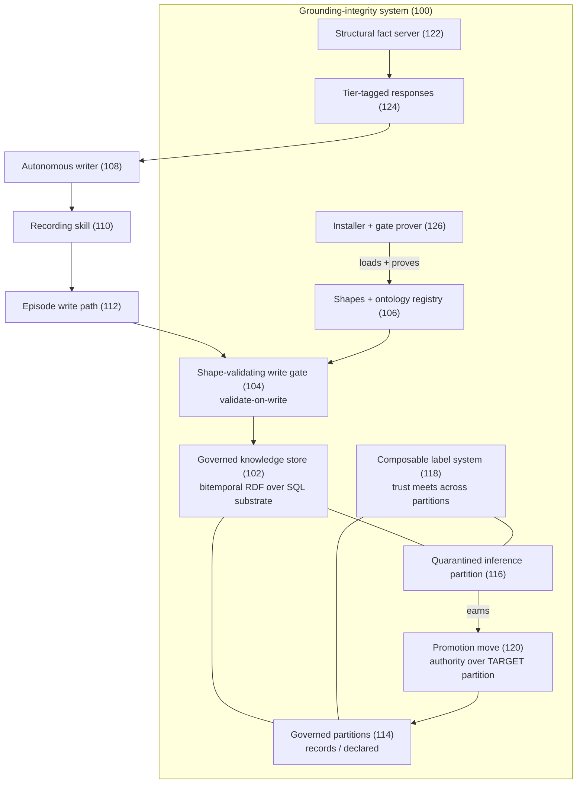
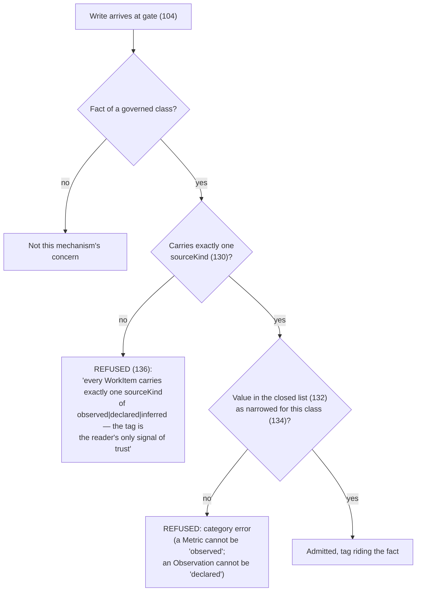
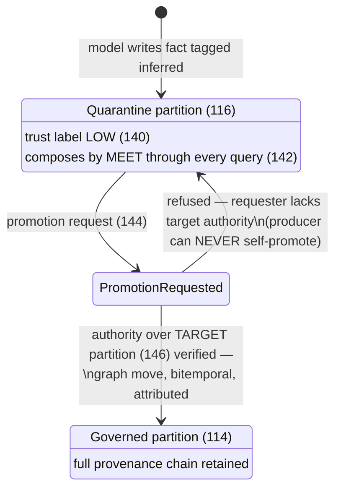
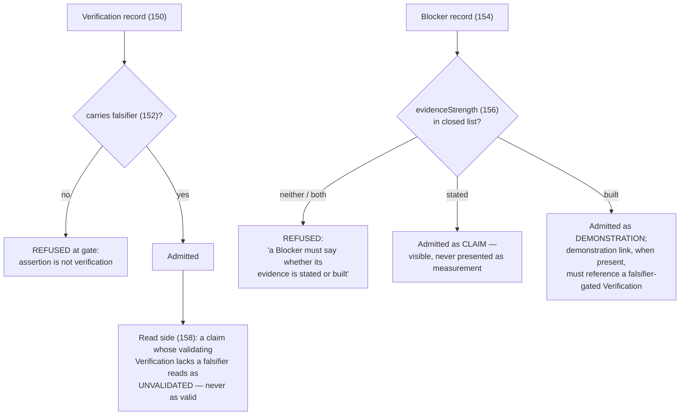
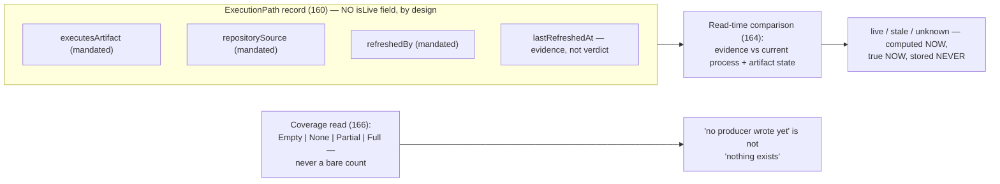
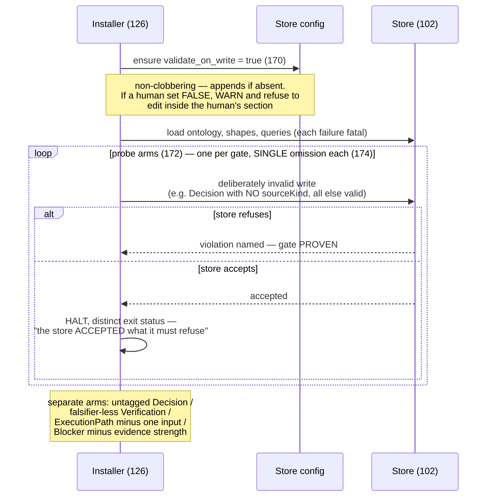
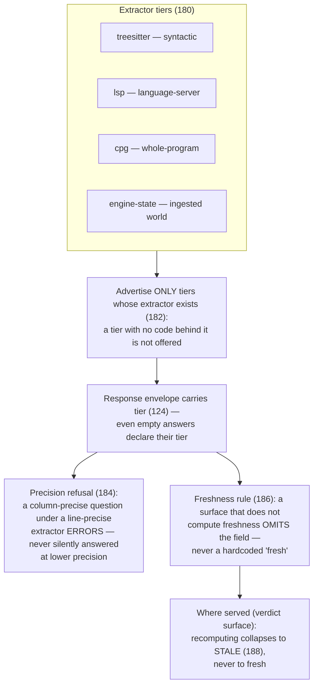
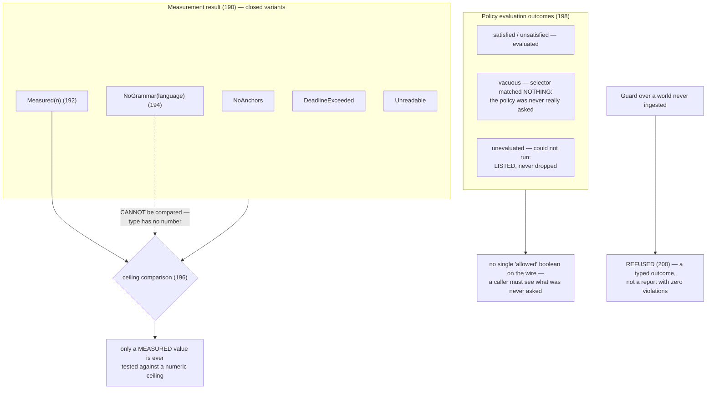
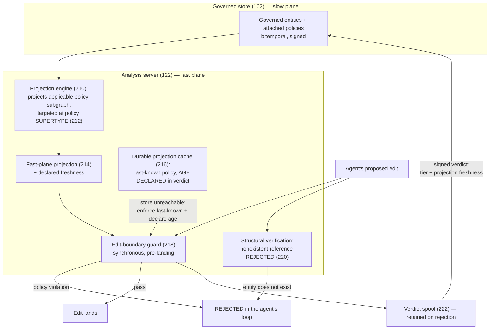

# Provisional Patent Application

## Grounding-Integrity Machinery for Machine-Written Knowledge: Provenance-Refusing Ingress, Quarantined Inference with Governed Promotion, Falsifier-Gated Verification, Tier-Honest Fact Serving, and Typed Non-Answers

**Inventor:** Stephen C. Brown

**Filing type:** Provisional application for patent under 35 U.S.C. § 111(b)

---

## Field of the Invention

The present invention relates to knowledge stores and analysis engines
written to and consulted by autonomous software agents, and more
particularly to mechanisms that prevent machine-fabricated or
machine-degraded information from masquerading as observed, verified,
precise, current, or healthy: refusing, at write time and by closed
vocabulary, any fact that does not declare its provenance kind; routing
machine-inferred knowledge into quarantined partitions whose low trust
composes through every query that touches them, promotable only by an
authority-gated, audited move; refusing verification claims that do not
name the observation that would have disproved them; refusing stored
judgments that decay, in favor of judgments computed at read time from
mandated evidence inputs; proving, at installation time and by
deliberately invalid probes, that each refusal gate actually refuses;
serving analysis facts under a closed precision-tier vocabulary such that
an approximation can never be presented as precise and absent freshness is
omitted rather than fabricated; and representing every non-answer — the
unmeasurable, the unevaluated, the vacuously matched, the unreachable —
as a distinct typed outcome that can never collapse into a passing one.

## Background of the Invention

Large-language-model-driven agents now write facts into knowledge stores,
claim to have verified their own work, and consume analysis results as
grounding for further action. Each of those three activities has a failure
mode in which fabricated or degraded information becomes
indistinguishable from trustworthy information. The problems below are
stated as technical problems in the operation of stores and analysis
engines, independent of any particular agent model.

**First, a fabricated fact is indistinguishable downstream from an
observed one.** When a deterministic parser and a language model both
write into the same store, nothing in a conventional store records which
writer produced which fact. A hallucinated fact — a model-invented
function, a misremembered decision, a plausible but false dependency —
carries exactly the shape of a true one, and every downstream consumer
that trusts the store inherits the fabrication. Retrieval-augmented
generation compounds the problem: the fabricated fact is retrieved as
grounding for the next generation, laundering the hallucination into
provenance.

**Second, provenance metadata is conventionally informational, not
enforced.** Systems that record provenance commonly attach it as optional
metadata: present when a well-behaved writer supplies it, absent
otherwise, and consulted — if at all — by a reader who must remember to
ask. An absent tag defaults to some reading, and either default is wrong:
treating untagged as trusted fail-opens the store to every writer that
forgets, and treating untagged as suspect poisons every legacy fact.
Recent systems attach provenance tags to machine-inferred values and
route on them — including tags distinguishing device-verified,
human-reported, and model-inferred values, with routing that keeps
inferred values away from decisions absent human confirmation
(G. Besanson Tanasi et al., "Veritas-RPM: Provenance-Guided Multi-Agent
False Positive Suppression for Remote Patient Monitoring," arXiv
preprint arXiv:2604.16081, is acknowledged as prior art for such a
provenance-tag taxonomy and routing discipline, in the remote-monitoring
domain) — but the tag remains a routing input, not a write-time
admission requirement of the store itself: nothing refuses the write
that carries no tag, and nothing prevents a writer from up-tagging its
own inference. What is needed is a store in which the untagged write is
refused at the gate by a closed vocabulary the writer cannot extend, in
which the permitted vocabulary is narrowed per fact class so that a
class whose instances can only ever be declarations cannot carry an
"observed" tag at all, and in which no path exists by which a producer
upgrades the trust of its own output.

**Third, a verification claim is itself a fabricable fact.** An agent
that writes "verified: the migration succeeded" into a store has written
an assertion, not a verification. Nothing distinguishes a claim backed by
an observation from a claim backed by nothing; a store that accepts bare
verification records converts confidence into evidence. The missing
discipline is falsifiability: a verification record that does not carry
the observable result that would have disproved it is an assertion
wearing verification's name.

**Fourth, stored judgments decay.** A stored fact "this execution path is
live" or "this cache is current" is true at write time and silently
false later — the stored verdict ages into exactly the stale fact it was
meant to detect. Conventional schemas store such judgments anyway,
because the alternative — computing the judgment at read time — requires
the schema to have mandated, at write time, the evidence inputs the
read-time computation needs.

**Fifth, controls that cannot fail are read as coverage.** A validation
gate that is misconfigured, disabled, or never wired refuses nothing —
and a store that accepts everything is indistinguishable, from the
outside, from a store whose writers are all well-behaved. The inventor
observed a continuous-integration gate configured to continue on error
that ran for 126 seconds per build and had never once failed a build,
while its existence was read as coverage. An enforcement layer whose
being-on cannot be demonstrated is decoration; what is needed is a
mechanism that *proves* each refusal gate refuses — by submitting
deliberately invalid writes and halting if any is accepted — and that
performs this proof per gate with discriminating probes, so that one
gate's failure cannot make another look enforced.

**Sixth, approximation is served as precision, and staleness as
freshness.** Code-analysis engines derive facts at different precision
tiers — fast syntactic approximation, language-server-grade resolution,
whole-program analysis — and serve them through one interface. A
consumer that cannot see the tier treats a tree-sitter guess as an
LSP-verified fact. The same engines cache and incrementally recompute,
so a served fact may be current, stale, or mid-recomputation — and an
interface that cannot say so serves stale facts as fresh ones. The
failure has a subtle second form: an engine that *wants* to report
freshness but does not yet compute it may be tempted to stamp a
hardcoded "fresh" on every response, converting an honest gap into a
systematic lie.

**Seventh, non-answers collapse into answers.** A measurement that could
not be taken returns zero; a policy whose selector matches nothing
reports no violations; a policy that could not run is dropped from the
report; a guard evaluating an empty world finds nothing wrong; a
question asked at a precision the engine cannot honor is answered at a
lower precision without notice; a file that could not be read is
reported as unchanged. In every case a distinct epistemic state — could
not measure, never asked, could not run, nothing ingested, cannot honor,
could not look — is collapsed into the healthy reading. The inventor
measured a concrete instance: a blast-radius ceiling of zero denied an
edit in a language the engine could parse while allowing identical
edits in languages it could not, indistinguishably, because
"unmeasurable" and "measured zero" shared one representation.

The inventor is not aware of a system that addresses these problems
together with the properties described herein. Knowledge-graph systems
that build graphs from language-model output and store provenance
information for user inspection (e.g. US 2025/0131289 A1), and systems
that validate language-model outputs against ground-truth data and
attach citations (e.g. US 12,353,469 B1), are acknowledged as prior art
for informational provenance and post-hoc output validation
respectively. The present invention is directed not to informing a
reader about provenance but to *enforcing* grounding integrity in the
machinery itself: closed-vocabulary refusal at the write gate,
algebraic quarantine at query composition, authority-gated promotion,
falsifier-gated verification, installation-time gate proof, tier-honest
serving, and typed non-answers.

## Summary of the Invention

The invention comprises a cluster of cooperating mechanisms operating
across a governed knowledge store and a structural-analysis fact server.
Each mechanism is independently useful; in combination they form a
system in which no path exists by which machine-written information
gains trust it did not earn, loses qualification it was served with, or
converts silence into health.

In one aspect, the invention provides a knowledge-ingress method in
which every fact of a governed class must carry exactly one provenance
kind drawn from a closed vocabulary — in one embodiment
`observed` (produced deterministically from a record), `declared`
(stated by a human), and `inferred` (produced by a model) — enforced by
shape validation at the store's write gate such that an untagged write
is refused with a message naming the missing tag; wherein the permitted
vocabulary is *narrowed per class*, a class whose instances can only be
declarations admitting only `declared`, and a class recording
observations admitting only `observed`, so that a category error in
tagging is refused as such; and wherein no interface exists by which a
writer raises the provenance kind of its own prior write.

In another aspect, the invention provides quarantine of machine-inferred
knowledge: facts tagged as inferred land in a reserved partition (in one
embodiment a named graph) whose trust label, declared in a composable
label system, is low; because label composition takes the meet across
partitions touched by a query, any query result incorporating the
quarantined partition carries the quarantine's low trust — the
quarantine is enforced by the composition algebra, not by reader
discipline. Promotion of inferred knowledge to a governed partition is a
graph move requiring authority over the *target* partition, performed as
an ordinary governed write — bitemporal, attributable, auditable — and
expressly not performable by the producer of the inferred content.

In another aspect, the invention provides falsifier-gated verification:
a verification record is refused at the write gate unless it carries a
falsifier — the observable result that would have disproved the claim —
so that an assertion cannot wear verification's name; blocker records
must declare their evidence strength from a closed vocabulary
distinguishing a stated claim from a built demonstration, a
demonstration link when present being required to reference a
falsifier-gated verification record; and read-side queries report a
claim whose validating verification lacks a falsifier as unvalidated,
never as valid.

In another aspect, the invention provides liveness by deliberate
absence: record classes whose natural "is it live / current / still
true" judgment decays are defined *without* a stored judgment field —
the schema instead mandates, with per-field refusal messages, the
comparison inputs a read-time computation needs (in one embodiment an
executing-artifact identity, a repository source, and a refresh
mechanism reference), and the judgment is computed at read time by
comparing mandated evidence against current state; a related read-side
discipline reports dataset coverage as one of empty, none, partial, or
full rather than as a bare count, so that "no producer has written yet"
cannot be read as "nothing exists."

In another aspect, the invention provides installation-time gate proof:
an installer that (a) writes the store configuration that turns
validation-on-write on, refusing to weaken and warning rather than
silently rewriting a human's contrary setting; (b) loads the ontology,
shapes, and queries; and (c) *proves* each refusal gate by submitting a
series of deliberately invalid writes — each probe omitting exactly one
required property, so that the arms discriminate and a failure of one
gate cannot make another look enforced — halting the installation with a
distinct exit status if the store accepts any probe; together with a
session-start banner that reports exactly one of three states —
store unreachable ("could not look" — expressly not "nothing exists"),
reachable but gate unproven, and active — and never blocks the session.

In another aspect, the invention provides tier-honest serving of
analysis facts: every served response carries a precision tier drawn
from a closed vocabulary (in one embodiment `treesitter`, `lsp`, `cpg`,
`engine-state`), attached to the response envelope so that even an
empty or not-found answer declares the tier at which nothing was found;
the server advertises only tiers for which an extractor actually
exists; a question posed at a precision the current tier cannot honor
(a column-precise position under a line-precise extractor) is refused
with an error rather than answered at lower precision without notice;
freshness, where not computed for a surface, is omitted from that
surface rather than fabricated — the response simply lacks the field,
never carries a hardcoded current value — and where freshness is served
(in one embodiment on a policy-verdict surface), a mid-recomputation
state collapses conservatively to stale, never to fresh.

In another aspect, the invention provides typed non-answers: every
distinct way an answer can fail to exist is a distinct variant of a
closed result type — in one embodiment, a measurement result
distinguishing measured, no-grammar-for-this-language, no-anchors,
deadline-exceeded, and unreadable, wherein only the measured variant may
be compared against a numeric ceiling; a change-set result
distinguishing diffed, no-repository, and unresolved-reference, wherein
an empty change list may be treated as clean only when every file was
actually read; a policy-evaluation result in which a policy whose
selector matched nothing is reported as vacuous rather than satisfied,
a policy that could not run is listed as unevaluated rather than
dropped, and a guard asked to evaluate a world that was never ingested
refuses to evaluate rather than reporting zero violations; and an edit
verifier whose verdict enumerates the violation classes it did *not*
check at the current tier, so that a passing verdict cannot be over-read.

In another aspect, the invention provides fast-plane enforcement of
store-governed policy at an agent's edit boundary: entities and
policies are defined, versioned, and signed in the governed store; a
projection engine projects the applicable policy subgraph into the
fast in-memory plane of the analysis server, scoped to the agent's
work, and targeted at a policy supertype so that vocabulary evolution
cannot silently unbind enforcement; the edit boundary is guarded
synchronously — before a proposed edit lands — by evaluating the
projected policies and the structural graph against the edit, so that
an edit referencing an entity that does not exist (a hallucinated
reference) or violating an attached policy is rejected in the agent's
loop, in real time, at a declared precision tier; the projection
carries freshness, and a durable projection cache lets the guard
enforce last-known policy when the governed store is unreachable while
*declaring the cache's age in the verdict* rather than failing
silently open or silently closed; every verdict — rejection and pass
alike — is spooled and returned to the governed store as a signed
fact carrying its tier and its projection freshness, the spool being
retained rather than discarded when the store rejects a verdict; and
an inability to project the rule plane at all is a failure surface —
a status operation exits with a reserved failure code — never a
silently ungoverned session.

In further aspects, the invention provides: pre-existing-condition
discrimination in guarding, wherein a finding also present in the
pre-action state is reported as pre-existing and attributed to no
action, so that an actor is never blamed for a condition it did not
cause, and blame is computed from declared effects rather than
proximity; provenance-laddered authorization scope, wherein an agent's
permitted scope derives from its tracked work item with scope
provenance declared in a trust ladder (explicitly declared, structurally
derived, observed from prior sessions) and unknown scope advises rather
than blocks; and abstention as the honest resolver default, wherein
work-item resolution and command parsing abstain rather than guess,
because a wrong attribution manufactures false justification for
derived rules.

## Brief Description of the Drawings

**FIG. 1** is a block diagram of a grounding-integrity system (100)
according to one embodiment, showing a governed knowledge store (102)
with a shape-validating write gate (104) and shapes/ontology registry
(106), an autonomous writer (108) guided by a recording skill (110)
through an episode write path (112), governed partitions (114) and a
quarantined inference partition (116) under a composable label system
(118), an authority-gated promotion move (120), a structural-analysis
fact server (122) serving tier-tagged responses (124), and an installer
with gate prover (126).

**FIG. 2** is a diagram of the closed provenance vocabulary mechanism,
showing the provenance-kind property (130), the closed value list
(132), the per-class narrowing (134), and the write-time refusal with
naming message (136).

**FIG. 3** is a state diagram of quarantine and promotion, showing the
inference partition (116) with its low trust label (140), label meet at
query composition (142), and the promotion request (144) evaluated
against target-partition authority (146).

**FIG. 4** is a diagram of falsifier-gated verification, showing a
verification record (150) with mandated falsifier (152), a blocker
record (154) with closed evidence-strength vocabulary (156), and the
read-side unvalidated-claims query (158).

**FIG. 5** is a diagram of liveness by deliberate absence, showing a
record class (160) with mandated comparison inputs (162), the read-time
liveness computation (164), and coverage reporting (166) over
empty/none/partial/full.

**FIG. 6** is a sequence diagram of installation-time gate proof,
showing the installer (126), configuration write with non-clobbering
rule (170), the discriminating single-omission probe arms (172), the
halt on acceptance (174), and the three-state session banner (176).

**FIG. 7** is a diagram of tier-honest serving, showing extractor tiers
(180), the response envelope with tier tag (124), the
advertise-only-existing rule (182), the precision refusal (184), the
freshness-omission rule (186), and the conservative verdict-freshness
collapse (188).

**FIG. 8** is a diagram of typed non-answers, showing the measurement
result type (190) with its measured (192) and non-answer (194)
variants, the ceiling-comparison gate (196) admitting only measured
values, the vacuous and unevaluated policy outcomes (198), and the
guard refusal over an empty world (200).

**FIG. 9** is a diagram of fast-plane policy enforcement at the edit
boundary, showing the governed store (102) defining entities and
policies, the projection engine (210) targeting a policy supertype
(212), the fast-plane projection with declared freshness (214), the
durable projection cache with age declaration (216), the edit-boundary
guard (218), the nonexistent-reference rejection (220), and the signed
verdict return path with retained spool (222).

## Detailed Description of the Invention

The following description sets forth numerous specific details to
provide a thorough, enabling disclosure. It will be apparent to one
skilled in the art that the invention may be practiced without these
specific details, and that the specific technologies named — a
particular constraint language, a particular graph data model, a
particular systems programming language, particular property names —
are exemplary embodiments, not limitations. Throughout, mechanisms
present in the working reference implementation are so described, and
mechanisms disclosed as designed combinations over that implementation
are expressly identified as contemplated embodiments.

### 1. System overview

FIG. 1 shows a grounding-integrity system (100) according to one
embodiment.

In one embodiment the governed store (102) is an embeddable bitemporal
RDF knowledge-graph store supporting SHACL shape validation on write,
named graphs, and composable per-graph labels; the ontology and shapes
(106) are supplied by a knowledge-discipline package; the
structural-analysis server (122) is an in-memory code-analysis engine
written in Rust serving parsed structure over CLI, MCP, and HTTP
surfaces; and the autonomous writer (108) is a large-language-model
coding agent operating under a harness that loads the recording skill
(110). Facts of governed classes — work items, decisions, verification
records, execution paths, blockers, and others — are written through an
episode-shaped path (112) that attaches generation provenance; in the
reference implementation the episode path supplies
provenance-generation linkage and idempotent semantics at the store,
while certain bulk ingestion paths write validated graph payloads
directly, the gate (104) applying in either case. Nothing in the
mechanisms below depends on these choices; alternative embodiments are
identified throughout and generalized in § 10.

### 2. Closed, per-class-narrowed provenance vocabulary with write-time refusal (FIG. 2)

#### 2.1 The tag is the reader's only signal of trust

Every fact class governed by the ingress discipline carries a
provenance-kind property — in one embodiment `sourceKind` — whose value
answers one question: *how did this fact come to exist?* The reference
vocabulary is closed at three values: `observed` (produced by a
deterministic parser from a record, no model in the loop), `declared`
(stated by a human), and `inferred` (produced by a model). The
discipline is deterministic-first: if a parser can produce the fact
from a record, the parser does — because a hallucinated fact is
indistinguishable downstream from a real one on exactly the facts
tagged trustworthy.

#### 2.2 Mechanism operation

In one embodiment the enforcement is a SHACL property shape per
governed class: path `sourceKind`, `minCount 1`, `maxCount 1`, and an
`sh:in` closed list, with a refusal message naming the class, the
requirement, and the rationale. The store's write gate validates every
write against the registered shapes and refuses non-conforming writes
transactionally; the refusal message reaches the writer.

Three properties are deliberate:

1. **The vocabulary is closed, not extensible.** A writer cannot mint a
   fourth kind. `sh:in` enumerates the permitted literals; anything
   else — including the empty string, including a plausible synonym —
   is refused. An open vocabulary would let a model invent a
   trust-implying tag ("canonical", "confirmed") that no reader's
   policy anticipates.

2. **The vocabulary is narrowed per class (134).** The full three-value
   list applies to classes whose instances may genuinely arise any of
   the three ways (work items, decisions, verification records,
   execution paths, blockers). But a metric definition or a
   nonfunctional requirement is *only ever* a declaration — its shape
   admits only `declared` — and an observation record is only ever
   observed — its shape admits only `observed`. The narrowing turns a
   category error into a refusal: a model that writes an "observed"
   requirement has fabricated an observation, and the store says so at
   the gate rather than leaving a reader to notice.

3. **Never up-tag.** No interface exists by which a producer raises the
   provenance kind of its own output — there is no re-tagging write
   path, and the ontology documentation states the rule ("Mandatory;
   SHACL-refused when absent. Never up-tag."). Elevation of inferred
   knowledge is exclusively the promotion move of § 3, which is
   performed by a different authority against a different partition.

In the reference implementation the tagged classes are the
crew-knowledge vocabulary (work items, decisions, verifications,
execution paths, blockers, metric definitions, observations); code and
document entities seeded by deterministic walkers are governed by their
own shape family, their observed character being a property of the
walker rather than a per-fact tag, and extending the per-fact tag to
those classes is a contemplated embodiment.

In alternative embodiments the vocabulary is any closed set of
provenance kinds with a defined trust ordering; the constraint
language is any schema system supporting required-single-valued
closed-enumeration properties with refusal (relational CHECK
constraints, JSON-schema enum with additionalProperties refusal,
protocol-buffer validation); and per-class narrowing is any
per-type restriction of the global vocabulary to the kinds that class
can truthfully bear.

### 3. Quarantined inference with governed promotion (FIG. 3)

#### 3.1 Quarantine by algebra, not by discipline

Machine-inferred knowledge — session summaries, failure diagnoses,
"lessons learned" — is valuable and dangerous for the same reason: it
generalizes. The invention neither bans it nor trusts it: inferred
facts land in a reserved partition (in one embodiment a named graph)
(116) whose trust label under the store's composable label system
(118) is declared low. The label system composes trust by meet — the
lesser of the trust values — across every partition a query touches.
The consequence is the load-bearing property: **any query whose answer
draws on the quarantined partition carries the quarantine's low trust
in its composed label, automatically.** A reader need not remember to
check; the algebra remembers. Readers or floors that require higher
trust exclude or refuse accordingly.

#### 3.2 Promotion is a governed graph move

Inferred knowledge can *earn* elevation — after human review, after
corroboration by an observed fact, after a validation the deployment
trusts. Promotion is deliberately not an ingress feature and not a
re-tag: it is a move of the fact between partitions, executed as an
ordinary governed write against the *target* partition. Because the
store's authority machinery evaluates writes against the partition
being written, promotion requires authority over the governed target —
authority the inference producer does not hold. The move is bitemporal
(the fact's history shows quarantined residence before promotion),
attributable (who promoted), and auditable (the promotion is itself a
fact). The skill that guides recording states the agent-facing rule:
promotable later by someone with authority — never by you.

#### 3.3 Implementation status and combination

The quarantine-and-promotion combination is disclosed as a contemplated
embodiment over implemented substrate: the reference store implements
named-graph partitions, composable per-graph labels with meet
composition, enforcement floors, and graph-scoped write authority; the
reference ingress discipline implements the `inferred` tag and the
agent-facing quarantine rules; the routing of inferred-tagged writes
into the reserved partition and the promotion move are specified in the
ingress design and are exercised in the reference deployment as skill
discipline rather than as an enforced router. An embodiment in which
the write gate itself derives the target partition from the provenance
kind — an inferred-tagged write to a governed partition being refused
or redirected — is expressly contemplated, and is the primary
embodiment for enforcement purposes.

In alternative embodiments the partitions are any data partition
(tables, collections, tenants); the label system is any composable
label algebra whose composition cannot raise trust; and promotion
generalizes to any authority-gated move between partitions of differing
declared trust, including staged multi-step promotion ladders.

### 4. Falsifier-gated verification and evidence-strength-typed blockers (FIG. 4)

#### 4.1 A verification without a falsifier is an assertion

A verification record (150) is refused at the gate unless it carries a
falsifier (152): the observable result that would have proved the claim
wrong. In the reference implementation this is a shape constraint
(`falsifier`, `minCount 1`, `maxCount 1`, string-valued) with the
refusal message:

> a Verification without a falsifier is an assertion, not verification
> — record the result that would have proved it wrong

The requirement is an ingress obligation, not a convention for a reader
to remember. Its effect on machine writers is structural: an agent that
"verified" something without running anything cannot name a falsifier
that was capable of failing, and the record it can truthfully write is
an assertion — taggable, at best, as `inferred` or `declared` — not a
`Verification`.

#### 4.2 Blockers declare their evidence strength

A blocker record (154) must declare, from a closed two-value vocabulary
(156), whether its evidence is `stated` (a claim in a ticket or report)
or `built` (a demonstrated failing case). The distinction lets a reader
keep a stated blocker visible without presenting it as a measurement. A
demonstration link (`demonstratedBy`), when present, is type-checked to
reference a verification record — which, by § 4.1, carries a falsifier.
In the reference implementation the demonstration link is optional
(type-checked when present, not required), the producer integration
that emits built demonstrations being external; an embodiment requiring
a demonstration link on every `built` blocker is contemplated.

#### 4.3 Absence reads as unvalidated

The read side completes the discipline: the reference implementation's
catalogue queries report a metric claim whose validating verification
is absent *or lacks a falsifier* as unvalidated — the filter requires
the verification and its falsifier to exist before a claim reads as
validated, so that neither a missing verification nor a gutted one can
launder a claim. The general rule — absence of qualifying evidence
reads as the unqualified state, never as the qualified one — is applied
throughout and claimed as such.

### 5. Liveness by deliberate absence; coverage over counts (FIG. 5)

#### 5.1 The schema refuses the decaying judgment

Some judgments are true only at the moment they are computed: is this
execution path live, is this artifact current, is this work still in
progress. A stored `isLive` field ages into exactly the stale fact it
claims to detect. The invention's record classes for such subjects are
defined with the judgment field *deliberately absent* — a repo-wide
absence, documented in the ontology, the shapes, and the design — and
with the shape instead mandating the **comparison inputs** (162) a
read-time computation needs, each with its own refusal message. In the
reference implementation an execution-path record must carry the
executing-artifact identity (what runs), the repository source (what it
was built from), and the refresh mechanism reference (what would update
it); a timestamped refresh observation is evidence, never a stored
current/correct verdict. Liveness (164) is then a read-time verdict:
mandated evidence compared against current process and artifact state.

The refusal is two-sided: the shape refuses a record missing its
comparison inputs (the read-time computation would be impossible), and
the deliberate absence of the judgment field means no producer can
store the decaying verdict even helpfully.

#### 5.2 Coverage over counts

A companion read-side discipline: inventory queries report dataset
coverage (166) as one of `Empty` (no dataset members at all), `None`
(members present, none produced), `Partial`, or `Full`, rather than a
bare count — the same coverage vocabulary the store's label system uses
for label folds. A zero count collapses "no producer has written yet"
and "producers wrote and found nothing" into one number; the coverage
vocabulary keeps them distinct, and the reference deployment's status
surfaces state the distinction ("could not look" is not "nothing
exists"). In the reference implementation the coverage query executes
store-side; the discipline is stated here as part of one ingress-and-
reading system.

### 6. Installation-time gate proof (FIG. 6)

#### 6.1 A gate that is off is a report, never a workaround

Every refusal mechanism above depends on validation-on-write being on
and the shapes being loaded — a deployment property no shape can
enforce about itself. The invention therefore makes gate-proof an
installation-time mechanism (126):

Four properties are deliberate:

1. **The probes are discriminating: one omission per arm (174).** The
   untagged-write probe omits only the provenance tag; the falsifier
   probe carries a valid tag and omits only the falsifier; the
   execution-path probe omits exactly one mandated comparison input;
   the blocker probe omits only the evidence strength. The reference
   implementation records the rationale in the probe code itself:
   otherwise a provenance-tag failure could make a missing-falsifier
   shape look enforced when it never ran. Each gate is proven by a
   refusal only *it* can produce.

2. **Acceptance halts the install with a distinct exit status.** A
   store that accepts a probe is a store whose gate is off; proceeding
   would deploy the discipline's vocabulary without its enforcement —
   the "control that cannot fail" of the Background. The reference
   implementation prints the failure and exits with a reserved status;
   the installing agent's instructions are to stop, not to work around.
   The stated posture: a gate that is off is a report, never a
   workaround.

3. **The configuration write is non-clobbering toward humans (170).**
   The installer ensures validation-on-write is on by appending
   configuration when absent; when a pre-existing human-set
   configuration disables validation, the installer warns and refuses
   to edit inside the human's section — enforcement is turned on by
   machinery, but never by silently overriding a human's contrary
   record.

4. **The session banner is three-state and never blocks (176).** At
   session start a hook reports exactly one of: the store is
   unreachable ("could not look, not nothing exists" — a typed
   non-answer per § 8); the store is reachable but the discipline's
   shapes are not present ("the gate is not proven"); or active. All
   paths exit successfully — the banner informs the agent's honesty
   posture; it does not convert an observability gap into an outage.

In alternative embodiments the probes cover any refusal gate
(constraint systems, policy engines, admission webhooks); probe arms
are generated from the shapes themselves (one arm per mandatory
property, expressly contemplated); the proof runs periodically rather
than only at installation; and the proof's outcomes are recorded as
facts in the governed store, making "when was this gate last proven?"
queryable.

### 7. Tier-honest serving of structural facts (FIG. 7)

#### 7.1 The closed tier vocabulary and the envelope rule

The structural fact server (122) derives facts at different precision
tiers. Every served response carries a `tier` (124) from a closed
vocabulary — in the reference implementation exactly four values:
`treesitter` (syntactic approximation), `lsp` (language-server-grade),
`cpg` (whole-program), `engine-state` (authoritatively ingested world
state) — with no free-form escape. The tier rides the **response
envelope**, not merely the items, so an empty or not-found answer still
declares the tier at which nothing was found: "no references at the
treesitter tier" and "no references" are different findings, and the
envelope keeps them different.

#### 7.2 Four honesty rules

1. **Advertise only what exists (182).** The server's capability
   surface lists a tier only where an extractor is actually compiled
   in; the reference implementation removed feature flags that gated
   no code precisely because an advertised-but-empty tier is a
   masquerade at the capability level, and tests pin the advertisement
   to the build in both directions. A feature-gated serving surface
   whose engine is not built in returns not-found rather than mounting
   a route that cannot answer.

2. **Refuse precision you cannot honor (184).** A position query
   carrying file, line, *and column* under an extractor that resolves
   at line precision is refused with an error naming the limitation —
   deliberately not answered at line precision without notice, because
   the caller's column expresses a precision expectation the answer
   would silently betray. A miss is explained ("could not find what
   you pointed at") rather than reported as absence.

3. **Omitted, never fabricated (186).** The reference implementation
   tracks per-file freshness internally (fresh, stale, recomputing,
   with real transitions driven by a file watcher), but the graph
   query surfaces do not yet serve it — and the responses therefore
   *omit* the freshness field rather than stamping a value. The
   implementation history records the rule being applied to itself: an
   earlier revision asserted freshness was served when it was not, and
   the fix was to correct the claim — and separately to remove a
   hardcoded `fresh` from a signed verdict — rather than to fake the
   field. A response that cannot state freshness truthfully says
   nothing, and a reader must treat the absence as unknown, not as
   fresh.

4. **Where served, collapse conservatively (188).** On the surface
   that does serve freshness — the policy-verdict surface, where a
   verdict states whether the governed rule projection it judged
   against is current, including its cache age — a mid-recomputation
   state collapses to `stale`, never to `fresh`, when the consuming
   schema admits only two values. The conservative reading cannot
   overstate. The served freshness is expressly the freshness *of the
   rule projection used to judge*, a different quantity from code-fact
   freshness; the two are kept distinct rather than conflated into one
   flattering number.

In alternative embodiments the tier vocabulary is any closed set of
precision or derivation grades with a defined trust ordering; envelope
tagging generalizes to any response schema in which the grade is
mandatory at the answer level; and precision refusal generalizes to any
query surface where the question's stated precision exceeds the
answerable precision on any axis (position, time, identity).

### 8. Typed non-answers (FIG. 8)

#### 8.1 Every way of not knowing is its own type

The system's guards and measurements return closed result types in
which each distinct epistemic failure is a distinct variant — and in
which the healthy variant is the *only* one that downstream numeric or
boolean logic will accept.

Reference-implementation instances, each independently useful and
jointly claimed as one discipline:

- **Measurement (190).** A blast-radius measurement returns one of:
  measured (192), no-grammar-for-this-language, no-anchors,
  deadline-exceeded, or unreadable (194). Only the measured variant
  carries a number, so only it *can* be compared against a configured
  ceiling (196) — the defect this repaired, a ceiling of zero denying
  parseable-language edits while allowing unparseable-language edits
  indistinguishably, is structurally unrepresentable in the typed
  form.
- **Change detection.** A changed-paths result distinguishes diffed /
  no-repository / unresolved-reference, and an empty change list may
  be read as "clean" only when every file was actually read — "could
  not look" is not "nothing changed."
- **Policy evaluation (198).** A policy whose selector matched no nodes
  is reported `vacuous` — a selector that rotted away from the
  vocabulary reads exactly like a clean report unless vacuity is a
  named outcome. A policy that could not run is listed `unevaluated` —
  a dropped policy is indistinguishable from a satisfied one. An
  aggregate "allowed" boolean is deliberately not a wire field, so no
  caller can read one bit and skip the outcomes that were never asked.
- **Refusal over an empty world (200).** A guard asked to evaluate
  orders against a world nobody ingested *refuses to evaluate* — a
  typed refusal outcome, not a report with zero violations — because
  zero violations over a dead backend is a green light with nothing
  behind it.
- **Verification with unchecked disclosure.** The edit verifier
  returns, with every verdict, the list of violation classes it did
  *not* check at the current tier (in the reference implementation,
  type violations are never produced at the syntactic tier and are so
  listed). A passing verdict is thereby a bounded claim — "no unknown
  identifiers, no arity mismatches, imports resolve; types unchecked"
  — that cannot be over-read as full verification. The verifier's
  false-positive discipline is part of the mechanism: only calls the
  edit introduces are checked, bindings the buffer creates are
  excluded, and ambiguous cases are left unflagged, because a guard
  that cries wolf teaches its consumer to ignore refusals.
- **Pre-existing discrimination and declared-effect blame.** A guard
  finding also present in the pre-action state is reported
  pre-existing and attributed to no action; blame for a caused finding
  is computed from the action's *declared effects*, never inferred
  from proximity — an empty blame list on a caused finding is itself
  served as informative rather than papered over.
- **Abstention as the resolver default.** The work-item resolver and
  the command parser abstain rather than guess: an unknown verb, a
  compound command, or an unresolvable work item yields a typed
  abstention. The stakes are stated in the reference implementation:
  records are replayed to derive rules, so a wrong attribution does
  not mislabel one action — it manufactures false justification for a
  rule applied to everyone.

#### 8.2 The wire and the process are honest too

The discipline extends below the result types: a client that cannot
reach the resident analysis daemon receives a distinct, loud variant
the calling code is forced to handle — killing one process must not
silently bypass every guard. A tenant absent from the registry is
distinguished from a tenant with no overlay (the latter legitimately
composes the shared base). A status command exits with a reserved
nonzero code when the governance rule plane cannot be projected — the
rule plane is a failure surface, not a line of prose. And a promotion
path that would write to a *discovered* store endpoint (rather than a
configured one) refuses with a nonzero exit, so a script cannot read
exploration as authorization.

### 9. Fast-plane enforcement of governed policy at the edit boundary (FIG. 9)

#### 9.1 The loop this closes

An autonomous agent modifying a codebase works against entities the
deployment has chosen to govern: modules, services, data surfaces —
defined in the governed store with policies attached, both bitemporal
and signed. The governed store is deliberately the *slow* plane: its
job is authority, history, and audit, not per-keystroke latency. The
agent's edit loop is the *fast* plane: a proposed edit must be judged
in tens of milliseconds, synchronously, before it lands. The failure
this section's machinery excludes is the gap between the planes: an
agent writing code against an entity that does not exist (a
hallucinated reference), or in violation of an attached policy, with
the violation discovered — if ever — minutes later in review or CI,
after further work has compounded on the bad edit.

#### 9.2 Mechanism operation

1. **Projection, targeted at the supertype (212).** The projection
   engine (210) reads the governed store's applicable policies —
   including their constraint class and placement metadata — into the
   fast plane. The projection query targets the policy *supertype*
   rather than one concrete class: the reference implementation was
   corrected to do so precisely because a projection bound to a
   concrete class silently unbinds when the vocabulary evolves — a
   governance layer believed on while matching nothing, the
   Background's fifth problem in projection form. (A vacuously empty
   projection is separately visible per § 8's vacuous outcome.)

2. **Scope: the projection serves the agent's work.** The fast plane
   is per-tenant — the analysis server composes a shared read-only
   structural base with the working agent's own overlay — so the
   subgraph the guard consults reflects *this* agent's working state,
   not a stale shared view; in a contemplated embodiment the
   projection is further narrowed by the agent's tracked work item
   per § 10.1, so the fast plane holds approximately the subgraph the
   work declares it touches.

3. **Synchronous guarding at the edit boundary (218).** A pre-action
   hook runs before a proposed edit lands, inside the agent
   harness's tool-use cycle, under a hard latency budget. It
   evaluates the projected policies against the edit (capability
   rules, structural blast-radius ceilings per § 8's typed
   measurements, text rules) and returns allow, deny, or notify;
   every decision is recorded. In the reference implementation the
   blocking guard is opt-in and fail-open by design at this surface —
   an advisory posture the deployment can harden — while the
   companion verification surface below is where nonexistence is
   rejected; an embodiment in which both run in one pre-landing gate
   is contemplated.

4. **Hallucinated references are rejected structurally (220).** The
   verification surface (§ 8, verification with unchecked
   disclosure) re-analyzes the proposed buffer against the base
   graph: a call to an identifier that exists nowhere in the
   composed structural graph, an arity that matches no definition, an
   import that resolves to nothing — each is a violation naming the
   symbol, returned at a declared tier with the unchecked classes
   enumerated. The agent's fabricated entity is refused by the
   structure of the code it claimed to extend, in its own loop,
   before the edit lands — not minutes later in review.

5. **The cache declares its age (216).** Enforcement must not depend
   on the slow plane's availability — but silent fallback is how
   guards rot. The reference implementation persists the last
   successful projection in a durable cache after observing that a
   non-persistent cache left a fraction of edits unguarded across
   process restarts; when the store is unreachable the guard enforces
   the cached policy *and states the cache's age in the verdict
   text*, so a verdict rendered under stale policy says so — the
   § 7 freshness discipline applied to the enforcement plane itself.

6. **Verdicts return to the governed store, signed (222).** Every
   verdict is spooled and drained to the governed store as a signed
   fact carrying the tier at which it was judged and the freshness of
   the projection it was judged under (collapsing conservatively per
   § 7.2). The spool is retained rather than discarded when the
   store rejects a verdict — evidence of a disagreement between the
   planes is precisely the evidence worth keeping. The governed
   store thus holds the audit trail of fast-plane enforcement: which
   edits were refused, under which policy version, at which tier,
   how fresh — queryable with the same temporal semantics as
   everything else.

7. **Ungovernable is loud.** If the rule plane cannot be projected at
   all, the status surface exits with a reserved failure code — the
   rule plane is a failure surface, not a line of prose — and the
   promotion path refuses to write to a store endpoint that was
   *discovered* rather than configured, with a nonzero exit a script
   cannot read as success.

In alternative embodiments the fast plane is any in-memory or
edge-resident evaluation engine consuming a projection of a governed
policy store (API gateways over policy databases, admission
controllers over configuration stores, robotic actuator guards over
safety-case stores); the edit boundary generalizes to any pre-action
seam in an agent harness (tool dispatch, command execution, message
send); and the structural nonexistence check generalizes to any
authoritative-reference validation of a proposed action's operands
against the fast plane's composed world model.

### 10. Supporting mechanisms and generalizations

#### 10.1 Provenance-laddered scope; unknown scope advises

In a contemplated embodiment disclosed at the design stage, an agent's
authorization scope derives from its tracked work item — the work item
is the capability — and the scope's own provenance is declared in a
trust ladder: `declared` (explicit edges on the item, highest),
`derived` (labels, parent work, the structural graph), `observed` (what
prior sessions on the item actually touched, growing with use). Unknown
scope advises and never blocks, scope governs mutation rather than
observation, and one scope resolution feeds three consumers (policy,
trace, context). The trace substrate — work-item stamping that abstains
rather than guesses, command resolution to typed action tuples, an
advisory recording hook that always permits — is implemented in the
reference system; the scope-resolution and enforcement model is design
intent, and the pattern is claimed at the ladder-and-advisory level in
the aspects.

#### 10.2 Generalizations

- **Store substrate.** The governed store generalizes to any store
  with write-time schema refusal: relational engines with CHECK
  constraints and triggers, document stores with schema validation,
  any RDF store with SHACL. Named-graph partitions generalize to
  tables, collections, tenants, and shards.
- **Provenance vocabulary.** Three kinds generalize to any closed
  provenance taxonomy with a trust ordering (sensor-observed,
  human-attested, model-inferred, third-party-imported, …); per-class
  narrowing generalizes to any per-type restriction.
- **Label system.** The quarantine composes under any label algebra
  in which composition cannot raise trust; the meet is exemplary.
- **Falsifier.** The falsifier generalizes to any machine-checkable
  or human-readable statement of the disproving observation,
  including executable probes; blocker evidence strength generalizes
  to any closed claim-vs-demonstration vocabulary.
- **Gate proof.** Single-omission probes generalize to any
  admission-controlled system; the probe set may be derived
  mechanically from the schema (one probe per mandatory property).
- **Tier vocabulary.** Syntactic/semantic/whole-program/ingested
  generalize to any closed derivation-grade set: OCR confidence
  grades, sensor calibration grades, forecast model tiers.
- **Typed non-answers.** The variants generalize to any measurement
  or evaluation surface: the claim is the discipline — a closed
  result type per surface in which no non-answer variant is
  acceptable to logic that consumes answers — not the specific
  variant lists.
- **Writers.** Nothing requires the writers be machine-learning
  agents; the mechanisms govern any writer. The agentic setting is the
  motivating deployment because it maximizes the rate at which
  plausible falsehoods are produced and minimizes per-fact human
  review.

## Exemplary Aspects

The following numbered aspects illustrate, in claim-like form and at
several breadths, subject matter regarded as the invention. They are
exemplary and non-limiting.

1. A method of admitting facts into a knowledge store, comprising:
   maintaining, per governed fact class, a schema requiring exactly one
   provenance-kind value drawn from a closed vocabulary distinguishing
   at least deterministically observed, human-declared, and
   machine-inferred origins; validating every write of a governed class
   against said schema at a write gate; and refusing, with a message
   naming the missing or invalid tag, any write lacking exactly one
   permitted value, whereby no fact of a governed class exists in the
   store without a machine-checked provenance kind.

2. The method of aspect 1, wherein the closed vocabulary is narrowed
   per fact class such that at least one class admits only a single
   provenance kind, a write tagging an instance of that class with any
   other kind being refused as a category error.

3. The method of aspect 1, wherein no interface of the store permits a
   writer to raise the provenance kind of a previously written fact,
   elevation of machine-inferred content being exclusively a
   partition-move operation under aspect 5.

4. The method of aspect 1, further comprising routing facts bearing the
   machine-inferred kind into a reserved partition whose declared trust
   label, under a composable label system in which composition cannot
   raise trust, is lower than that of governed partitions, whereby any
   query result drawing on the reserved partition carries the reduced
   trust in its composed label without reader intervention.

5. The method of aspect 4, further comprising promoting a fact from the
   reserved partition to a governed partition only by a move operation
   authorized against the target partition, recorded with attribution
   and temporal history, the producer of the fact holding no authority
   to perform the move.

6. A method of recording verification in a data store, comprising:
   refusing, at a write gate and by schema, any verification record
   that does not carry a falsifier field stating the observable result
   that would have disproved the verified claim; and reporting, on the
   read side, any claim whose associated verification record is absent
   or lacks a falsifier as unvalidated, absence of qualifying evidence
   never being reported as validation.

7. The method of aspect 6, further comprising requiring each blocker
   record to declare exactly one evidence strength from a closed
   vocabulary distinguishing a stated claim from a built demonstration,
   and type-checking any demonstration link to reference a
   falsifier-bearing verification record.

8. A method of representing decaying judgments in a data store,
   comprising: defining a record class for a subject whose
   liveness-like judgment changes after write time without a stored
   judgment field; requiring instead, by schema with per-field refusal,
   the comparison inputs sufficient to compute the judgment at read
   time, including at least an artifact identity and a source
   reference; and computing the judgment at read time by comparing the
   mandated inputs against current system state, whereby no stored
   verdict can age into the stale fact it purports to detect.

9. The method of aspect 8, further comprising reporting inventory
   coverage as one of empty, none, partial, and full rather than as a
   bare count, a dataset with no producing members being reported
   distinctly from a dataset whose members produced nothing.

10. A method of installing an enforcement discipline onto a data store,
    comprising: ensuring a validation-on-write configuration is
    enabled, appending configuration where absent and, where a
    human-authored configuration disables validation, warning and
    declining to modify the human-authored setting; loading schemas
    into the store; submitting a plurality of deliberately invalid
    probe writes, each probe omitting exactly one required property of
    one schema such that each gate is proven by a refusal only it can
    produce; and halting the installation with a distinct failure
    status upon the store accepting any probe.

11. The method of aspect 10, further comprising reporting, at the start
    of an agent session, exactly one of at least three states — the
    store unreachable, the store reachable with the discipline's
    schemas absent, and the discipline active — wherein the
    unreachable state is reported as inability to observe rather than
    as absence of enforcement, and no state blocks the session.

12. The method of aspect 10, wherein the probe set is derived
    mechanically from the loaded schemas, one probe per mandatory
    property.

13. A method of serving analysis facts, comprising: deriving facts at a
    plurality of precision tiers; attaching to every served response,
    including empty and not-found responses, exactly one tier value
    from a closed vocabulary; and advertising, on the server's
    capability surface, only tiers for which a deriving extractor is
    present in the running build.

14. The method of aspect 13, further comprising refusing, with an error
    identifying the limitation, any query whose stated precision on
    any axis exceeds the precision the present tier can honor, the
    query never being answered at a lower precision than stated
    without notice.

15. The method of aspect 13, further comprising omitting a freshness
    field from any served surface for which freshness is not computed,
    a fabricated or hardcoded freshness value never being served, and,
    on a surface where freshness is served with a narrower consuming
    vocabulary than the internal state, collapsing an intermediate
    recomputing state to stale and never to fresh.

16. The method of aspect 15, wherein a freshness value served with a
    policy verdict denotes the currency of the rule projection used to
    judge, stated together with the projection's age, and is not
    conflated with the freshness of the underlying analyzed facts.

17. A method of returning measurements in a guarded system, comprising:
    returning, from a measurement operation, one variant of a closed
    result type distinguishing a measured value from each of a
    plurality of non-answer conditions including at least
    unparseable-input and deadline-exceeded; and comparing against any
    configured numeric threshold only the measured variant, the
    non-answer variants carrying no number and thereby being
    structurally incapable of satisfying or violating the threshold.

18. A method of reporting policy evaluation, comprising: reporting a
    policy whose selector matched no nodes as vacuous rather than
    satisfied; listing a policy that could not be evaluated as
    unevaluated rather than omitting it; refusing to evaluate, with a
    typed refusal outcome, a request against a world state that was
    never ingested; and omitting from the wire format any aggregate
    boolean that would permit a consumer to accept a result without
    observing which policies were never asked.

19. A method of verifying a proposed edit against an analysis graph,
    comprising: checking the edit at a stated precision tier for at
    least references to identifiers that do not exist and mismatched
    arity; returning with the verdict an enumeration of violation
    classes not checked at that tier; and excluding from violation any
    call site the edit did not introduce and any name the edited
    buffer itself binds, whereby a passing verdict is a bounded claim
    that cannot be over-read and refusals are reserved for violations
    the edit itself would introduce.

20. A method of attributing guard findings, comprising: re-evaluating
    each finding against the pre-action state; reporting a finding
    also present pre-action as pre-existing and attributing it to no
    action; and computing blame for caused findings from effects
    declared by the actions rather than from proximity, an empty blame
    attribution being served as informative rather than suppressed.

21. A method of scoping an autonomous agent's authority, comprising:
    deriving the agent's permitted scope from a tracked work item;
    labelling each scope element with a scope provenance from a closed
    ladder distinguishing at least explicitly declared, structurally
    derived, and observed-from-prior-sessions origins; and, where
    scope is unknown, advising rather than blocking, scope being
    applied to mutating actions and not to observation.

22. The method of aspect 21, wherein a work-item resolver and a
    command parser abstain, returning a typed abstention rather than a
    guess, when resolution is ambiguous, records so produced being
    used to derive policy such that a false attribution would
    manufacture justification for a derived rule.

23. A method of enforcing store-governed policy at an autonomous
    agent's action boundary, comprising: maintaining entities and
    policies in a governed store; projecting an applicable policy
    subgraph into an in-memory fast plane of an analysis server, the
    projection targeting a policy supertype such that evolution of
    concrete policy classes cannot silently unbind the projection;
    evaluating, synchronously and before a proposed action lands, the
    projected policies and a structural graph against the proposed
    action; rejecting, in the agent's loop and at a declared precision
    tier, an action that violates a projected policy or that
    references an entity absent from the structural graph; and
    recording every evaluation outcome.

24. The method of aspect 23, further comprising persisting the most
    recent successful projection in a durable cache, and, when the
    governed store is unreachable, enforcing the cached projection
    while declaring the cache's age within the rendered verdict, the
    guard neither silently passing nor silently enforcing stale policy
    unannounced; and treating inability to project the policy plane as
    a reserved failure status of a status operation rather than as an
    ungoverned session.

25. The method of aspect 23, further comprising returning each verdict
    to the governed store as a signed fact carrying the tier at which
    it was judged and the freshness of the projection under which it
    was judged, and retaining, rather than discarding, spooled
    verdicts that the governed store rejects.

26. A system comprising a processor and storage configured to perform
    the methods of aspects 1, 4, 6, 8, 10, 13, 17, 18, and 23 in
    combination, wherein a governed knowledge store enforces the
    provenance, verification, and liveness schemas of aspects 1, 6,
    and 8 at a validating write gate proven by the method of aspect
    10, machine-inferred facts are quarantined and promoted per
    aspects 4 and 5, an analysis fact server consulted by the same
    agents serves tier-tagged, freshness-honest, typed-non-answer
    responses per aspects 13, 17, and 18, and the same server enforces
    the store's policies at the agents' edit boundary per aspects 23
    through 25, whereby no path exists in the combined system by which
    machine-written information is admitted untagged, presented above
    its precision, aged into falsehood, read as healthy through
    silence, or landed as an edit against an entity that does not
    exist or a policy that forbids it.

---

*The foregoing is a provisional disclosure. No formal claims are
presented; the Exemplary Aspects above illustrate the subject matter
regarded as the invention. Provenance-tag taxonomies with routing
(Veritas-RPM, arXiv:2604.16081), informational provenance in
LLM-constructed knowledge graphs (US 2025/0131289 A1), and post-hoc
validation of model outputs against ground truth (US 12,353,469 B1)
are acknowledged as prior art for their respective concepts; the
mechanisms disclosed and aspected above are enforcement mechanisms —
write-gate refusal, algebraic quarantine, authority-gated promotion,
installation-time gate proof, tier-honest envelopes, and typed
non-answers — distinct from those concepts.*
